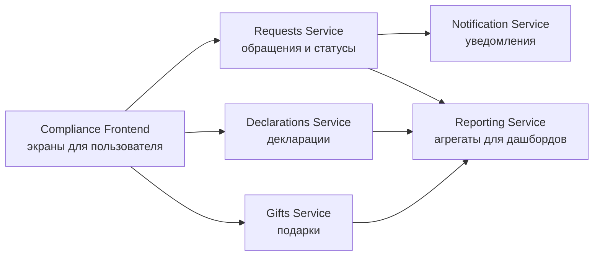
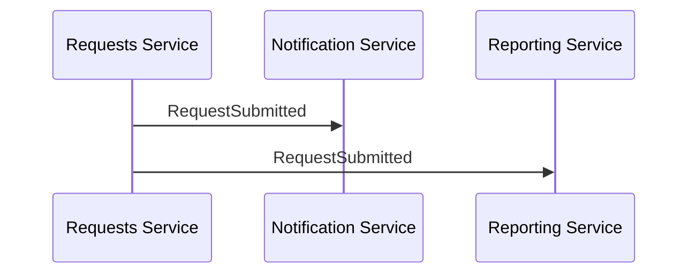

# Лекция 27. Микросервисы

## Почему после монолита появляется этот разговор

В прошлом уроке мы разобрали монолит и важную мысль: одно приложение не обязательно означает плохую архитектуру. Хороший модульный монолит может быть понятным, надежным и удобным для команды. Поэтому микросервисы не стоит воспринимать как автоматический следующий уровень зрелости, куда надо срочно перейти, чтобы система выглядела современной.

Разговор о микросервисах появляется тогда, когда у системы и команды меняется масштаб. Представим, что Compliance вырос. В системе уже не только обращения сотрудников, но и декларации конфликта интересов, подарки, согласования, уведомления, отчетность для руководителей, интеграции с кадровой системой и корпоративной SSO. Правила меняются часто, разные команды отвечают за разные области, а релиз одной части не должен каждый раз останавливать весь продукт.

В такой ситуации команда может спросить: а не пора ли разделить систему не только логически, но и физически? То есть сделать так, чтобы разные части поставлялись и запускались отдельно. Вот здесь мы приходим к микросервисной архитектуре.

## Что такое микросервис

Микросервис - это самостоятельная часть системы, которая отвечает за ограниченную область и общается с другими частями через явные контракты. Обычно это API, сообщения или события. У сервиса есть своя зона ответственности, свой жизненный цикл поставки и, в идеале, понятная граница данных.

В Compliance можно представить отдельный сервис обращений. Он знает, как создать обращение, какие у него статусы, какие переходы допустимы, как хранится история. Рядом может быть сервис уведомлений: он не решает, можно ли закрыть обращение, но умеет доставить сообщение сотруднику или офицеру. Еще рядом может быть сервис отчетности, который строит агрегаты для руководителя.

Учебная схема может выглядеть так:



В этой схеме слово `Service` не означает папку в проекте или маленький пакет кода. На уровне архитектуры это самостоятельный компонент системы со своей ответственностью: он запускается, изменяется и взаимодействует с другими компонентами по согласованным правилам. Стрелка тоже не просто украшение. Она показывает, что один компонент обращается к другому или передает ему данные.

На картинке это выглядит аккуратно. В реальности главный вопрос не в том, как красиво нарисовать пять прямоугольников. Главный вопрос - где проходит граница ответственности и что произойдет, когда один прямоугольник временно недоступен.

## Микросервис - это не просто маленькое приложение

Название может обманывать. "Микро" не означает, что сервис должен быть крошечным или состоять из пяти файлов. Если дробить систему слишком мелко, команда получит не архитектуру, а россыпь компонентов, между которыми трудно отследить один пользовательский сценарий.

Размер сервиса определяется не количеством строк кода, а смысловой границей. Сервис обращений может быть достаточно крупным, потому что вокруг обращения много правил: создание, уточнение, назначение офицера, статусы, аудит, сроки реакции. Разделить это на слишком маленькие сервисы только ради слова "micro" было бы странно.

Аналитику здесь важно мыслить не технологиями, а предметной областью. Если две функции меняются вместе, используют одни правила и требуют общей целостности данных, возможно, их рано разделять. Если область живет самостоятельным циклом, имеет отдельную команду, отдельные правила и понятный контракт с другими частями, она может стать кандидатом на сервис.

## Независимая поставка и цена независимости

Главное обещание микросервисов - независимость. Команда, которая отвечает за уведомления, может менять способ доставки сообщений, не выкатывая всю Compliance-систему. Команда отчетности может обновлять дашборды, не трогая сценарий создания обращения. Команда деклараций может развивать свой домен отдельно.

Но независимость не бесплатна. В монолите вызов соседнего модуля обычно происходит внутри одного процесса. В микросервисах части общаются по сети. Сеть может тормозить, запрос может не дойти, сервис может быть недоступен, контракт может измениться несовместимо. То, что раньше было внутренним вызовом, становится интеграцией.

Для аналитика это меняет качество вопросов. Недостаточно сказать: "после создания обращения отправить уведомление". Нужно понять, является ли уведомление обязательной частью операции. Если уведомление не отправилось, обращение считается созданным или нет? Нужно ли повторить отправку? Что увидит сотрудник? Как офицер узнает о новом обращении, если сервис уведомлений временно лежит?

В микросервисной архитектуре такие вопросы становятся обычной частью требований.

## Данные и границы владения

Одна из сложных тем микросервисов - данные. В монолите часто есть общая база, и разные модули читают нужные таблицы. Это удобно, но может размывать границы. В микросервисной архитектуре обычно стремятся к тому, чтобы сервис владел своими данными, а другие части не меняли их напрямую.

Если `Requests Service` владеет обращениями, то `Reporting Service` не должен напрямую менять статус обращения в таблице requests. Он может получать события, читать подготовленную витрину или вызывать согласованный API. Так сохраняется ответственность: только сервис обращений знает, какие переходы статуса допустимы.

С этой идеей связана неприятная правда: в распределенной системе сложнее обеспечить мгновенную согласованность всего со всем. Например, сотрудник создал обращение, сервис обращений сохранил его, а отчетность увидит новое обращение через несколько секунд после получения события. Для некоторых сценариев это нормально. Для других - нет.

Аналитик должен помочь команде понять, где нужна строгая целостность прямо сейчас, а где допустима задержка. В Compliance статус конкретного обращения в карточке должен быть надежным. А агрегат в дашборде руководителя может обновляться с небольшой задержкой, если это явно согласовано.

## Контракты между сервисами

Когда система разделена на сервисы, требования начинают жить не только на уровне пользовательских экранов. Появляются контракты взаимодействия. Один сервис вызывает другой, отправляет событие или ожидает ответ определенной структуры.

Например, после создания обращения сервис обращений может опубликовать событие:

```text
RequestSubmitted
requestId
employeeId
category
submittedAt
```

Это не код программы и не таблица базы данных. `RequestSubmitted` - учебное имя события, то есть сообщения о факте "обращение отправлено". Строки ниже показывают минимальные данные, которые другие компоненты могут использовать, чтобы понять, о каком обращении идет речь.



Сервис уведомлений подписывается на это событие и доставляет сообщение. Сервис отчетности использует его для обновления агрегатов. При этом ни уведомления, ни отчетность не должны решать, было ли обращение создано корректно. Это уже зона ответственности сервиса обращений.

Для системного аналитика контракт - не только техническая деталь разработчиков. В контракте отражаются данные, статусы, ошибки и ожидания по поведению. Если в событии нет категории обращения, отчетность не сможет строить разрез по категориям. Если в API нет понятного кода ошибки, frontend не сможет показать пользователю нормальное сообщение.

## Когда микросервисы помогают

Микросервисы хорошо работают, когда у команды уже есть причины платить за распределенную сложность. Например, разные области продукта развиваются разными темпами, нагрузка на части системы сильно отличается, команды могут владеть сервисами end-to-end, а инфраструктура умеет наблюдать, деплоить и сопровождать много компонентов.

В Compliance это могло бы проявиться так. Отчетность сильно нагружена тяжелыми запросами и развивается отдельно от обработки обращений. Уведомления обслуживают не только Compliance, но и другие внутренние системы. Декларации и подарки живут по своим регламентам и релизным циклам. Тогда разделение может снизить сцепление и дать командам больше автономии.

Но если продукт маленький, команда одна, доменная модель еще не устоялась, а инфраструктура не готова, микросервисы могут только добавить шум. Вместо одного понятного приложения команда получит несколько сервисов, логи в разных местах, сетевые ошибки, версионирование контрактов и сложность тестирования end-to-end.

## Как аналитику говорить о микросервисах без магии

Аналитику не обязательно проектировать всю инфраструктуру. Но важно не использовать слово "микросервисы" как заклинание. Лучше задавать вопросы о границах, ответственности и последствиях.

Если команда предлагает выделить `Notification Service`, стоит уточнить, какие системы будут им пользоваться, какие каналы он поддерживает, что считается успешной доставкой и что происходит при неудаче. Если предлагают выделить `Reporting Service`, нужно понять, насколько свежими должны быть данные и откуда он их получает. Если предлагают отдельный `Requests Service`, нужно зафиксировать, что именно он владеет статусами и правилами переходов.

Так разговор остается аналитическим. Мы не спорим "микросервисы хорошие или плохие". Мы обсуждаем, какую проблему они решают и какую сложность добавляют.

## Практический итог урока

Микросервисная архитектура разделяет систему на самостоятельно поставляемые сервисы с явными контрактами. Она может дать автономию команд, независимые релизы и более ясное владение отдельными областями. Но вместе с этим приносит сетевые сбои, версионирование контрактов, сложность данных, мониторинга и тестирования.

Для Compliance микросервисы стоит рассматривать не как обязательную цель, а как вариант роста. Сначала нужно понять доменные границы: обращения, декларации, подарки, уведомления, отчетность, доступ. Затем оценить, где независимость действительно полезна, а где модульного монолита пока достаточно.

На следующем уроке мы посмотрим на компонент, который часто стоит перед backend-частью системы и помогает принимать входящий трафик: reverse proxy и базовую идею балансировки.
