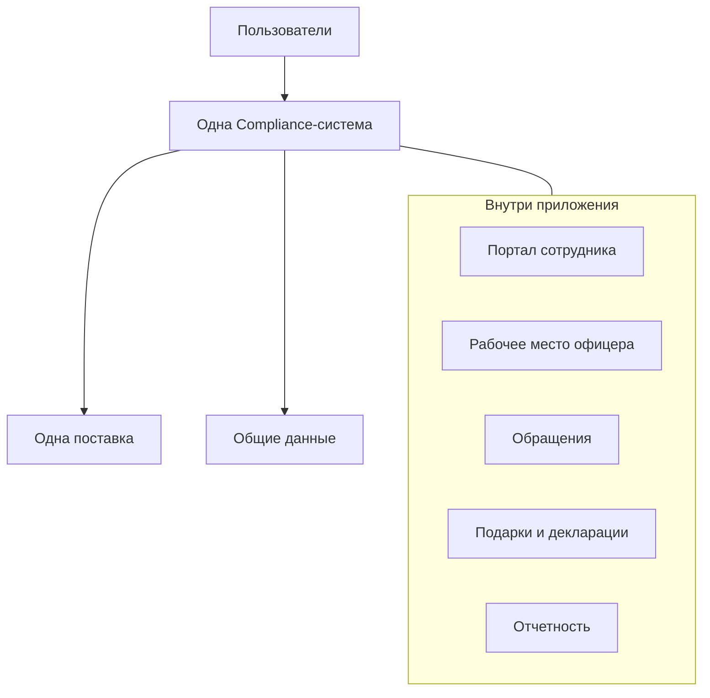
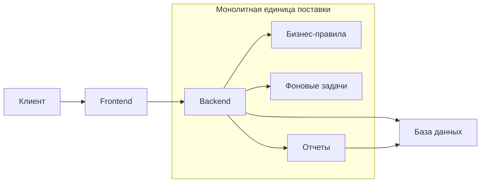
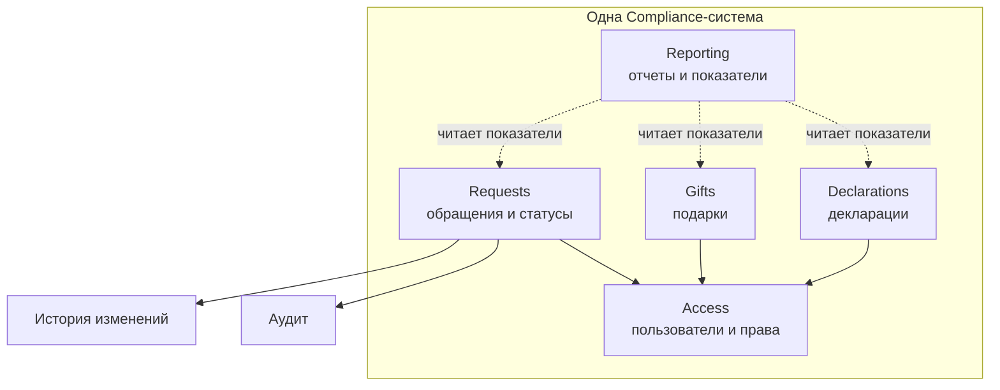

# Лекция 26. Монолит

## Откуда вообще взялся разговор о монолите

В прошлом уроке мы посмотрели на архитектурные стили как на разные способы организовать систему. Теперь разберем первый вариант отдельно: монолит.

Начнем не с определения, а с истории. Долгое время большинство бизнес-приложений не называли монолитами. Они просто были приложениями. У компании была учетная система, портал, программа для обработки заявок или внутренний кабинет. Команда писала код, собирала одну версию, устанавливала ее на сервер или рабочие места, пользователи работали.

Слово "монолит" стало чаще звучать позже, когда появились альтернативы: сервисная архитектура, микросервисы, облачные платформы, независимые поставки разных частей продукта. Тогда понадобилось название для системы, которая поставляется как одно целое. Не потому что она плохая, старая или примитивная, а потому что у нее такая граница развертывания.

Можно представить большой офисный центр. Внутри есть разные отделы: приемная, бухгалтерия, архив, юридический отдел, служба безопасности. Но для посетителя это одно здание с одним входом, одной вывеской и общими правилами работы. Аналогия не идеальна: программа не является зданием, а модули не сидят по кабинетам. Но она помогает почувствовать главное: внутри может быть много разных частей, а наружу система все равно выходит как единая единица.

## Простое определение

Монолит - это приложение, которое разрабатывают, собирают, поставляют и запускают как одну единицу.

Внутри у него могут быть отдельные экраны, правила, модули, таблицы, отчеты и фоновые задачи. Но когда команда выпускает новую версию, она выпускает одно приложение. Если изменили дашборд руководителя, исправили форму обращения или добавили проверку подарка, все это проходит через общий релизный контур.

Для Compliance это может выглядеть так:

```text
Compliance application
  |- employee portal
  |- officer workspace
  |- requests
  |- gifts and declarations
  |- reporting
  `- one release and deployment
```

Та же идея в виде схемы:



Слово "монолит" не означает "один файл" или "одна большая функция". Это не характеристика размера. Маленькое приложение может быть неаккуратным, а большой монолит может быть хорошо разделен внутри. Главное - единая поставка.

## Почему такой подход появился естественно

Когда команда только создает систему, ей часто важнее быстро понять предметную область, чем сразу разделить продукт на множество независимых частей. В Compliance еще предстоит уточнить, какие есть виды обращений, какие роли участвуют, какие статусы нужны, как проверяются подарки, кто видит декларации, какие события попадают в аудит.

Если все это живет в одном приложении, проще пройти путь пользователя целиком. Сотрудник отправляет обращение, система проверяет обязательные данные, создает карточку, назначает начальный статус, записывает историю и показывает номер. Команда видит весь сценарий рядом и быстрее замечает, где требование неполное.

У монолита есть понятные сильные стороны:

- один способ запуска и поставки;
- проще проследить сценарий от экрана до сохраненных данных;
- легче выполнить связанные изменения вместе;
- меньше инфраструктуры и сетевых взаимодействий между внутренними частями;
- проще учиться предметной области, пока границы еще меняются.

Это не значит, что монолит всегда дешевый или простой. Он тоже требует дисциплины. Но в нем меньше сложности распределенной системы: не нужно сразу думать о множестве отдельных сервисов, сетевых отказах между ними и независимом согласовании контрактов.

## Где проходит граница монолита

В уроке 24 мы смотрели на базовую схему:

```text
client -> frontend -> backend -> database
```

Монолит чаще всего обсуждают на стороне серверной части и поставки приложения. Пользователь может видеть разные экраны, а внутри продукта могут быть разные разделы. Но если бизнес-логика, обработка действий и работа с данными выпускаются одной общей версией, перед нами монолитный подход.



Важно не путать несколько вещей.

Если в приложении много разделов, это еще не микросервисы. Если в коде есть папки `requests`, `gifts` и `reporting`, это еще не отдельные поставляемые части. Если база данных общая, это частый признак монолита, но не единственный критерий. Ключевой вопрос звучит проще: может ли команда выпустить одну часть независимо от остальных или вся система выходит одной поставкой?

Для начинающего аналитика этого достаточно. На этом уроке не нужно знать технические детали обмена данными между частями системы. Нам важно понять организационную идею: система может быть одной единицей поставки, даже если внутри она состоит из нескольких смысловых областей.

## Монолит не обязан быть хаосом

Плохая репутация монолита появилась не на пустом месте. Многие команды видели системы, где любое маленькое изменение ломает соседние части, никто не понимает владельца данных, а старый код страшно трогать.

Но причина таких проблем не в самом факте единой поставки. Чаще причина в слабых внутренних границах.

Представим Compliance. Есть область обращений, область подарков, область деклараций, права доступа и отчетность. Если отчетность напрямую меняет статус обращения, экран подарков проверяет права по своим собственным правилам, а декларации используют неясные копии справочников, система становится хрупкой. Тогда новое правило в одной области неожиданно влияет на другую.

Такой монолит иногда называют "большим комком". Это не архитектурный стиль, а результат накопленных зависимостей. Хороший монолит устроен иначе: он остается одной поставкой, но внутри имеет понятные смысловые части.

## Модульный монолит

Модульный монолит - это монолит, в котором предметная область разделена на модули с понятной ответственностью.

```text
One Compliance application
  |- Requests: обращения и их статусы
  |- Declarations: декларации
  |- Gifts: подарки
  |- Access: пользователи и права
  `- Reporting: отчеты и показатели
```

На схеме это выглядит так: все остается внутри одного приложения, но ответственность разделена.



Модуль - не просто папка. У него есть своя область ответственности. Например, модуль `Requests` отвечает за жизненный цикл обращения: создание, статусы, историю, правила закрытия. `Reporting` может показывать количество обращений по статусам, но не должен сам решать, как переводить обращение из "в работе" в "закрыто".

Для аналитика это очень практичная мысль. Даже если команда не просит вас проектировать код, вы можете помочь увидеть границы: какая часть системы владеет статусом, где хранятся правила изменения, кто имеет право менять данные, какие другие части только используют результат.

## Общая база данных: удобно, но требует ясности

В монолите часто есть одна общая база данных. Это удобно: связанные данные находятся рядом, проще построить отчет, проще выполнить действие целиком.

Например, при создании обращения важно, чтобы карточка обращения и запись начальной истории не разъехались. Пользователь не должен получить номер обращения, которого на самом деле нет в системе. В едином приложении такие связанные изменения проще держать вместе.

Но общая база не отменяет вопрос "кто за что отвечает". Если все части приложения могут менять все таблицы как им удобно, порядок быстро исчезает. Поэтому аналитик фиксирует смысловые правила:

- что считается источником истины для статуса обращения;
- кто может менять данные обращения;
- какие изменения должны попадать в историю;
- какие данные нужны отчетности только для чтения;
- какие действия должны завершаться вместе.

Это пока не описание физической схемы базы данных. Это уровень понимания предметной области и поведения системы.

## Релизы и влияние изменений

У монолита один релизный контур. Это удобно, когда изменение действительно затрагивает весь сценарий. Команда выпускает одну версию, проверяет совместимость частей и видит результат целиком.

Но есть и цена. Если маленькое изменение в отчетности требует полного релиза всей Compliance-системы, нужно понимать риски. Не обязательно сразу бежать в микросервисы. Сначала стоит спросить:

1. Какие разделы системы участвуют в изменении?
2. Какие данные и роли затронуты?
3. Какие сценарии нужно перепроверить после релиза?
4. Можно ли улучшить внутренние границы модулей?
5. Действительно ли части продукта должны выпускаться независимо?

Например, новое правило закрытия обращения может повлиять на кабинет сотрудника, очередь офицера, историю статусов, аудит и дашборд руководителя. В монолите это не катастрофа. Это сигнал: требование нужно описать так, чтобы команда увидела весь путь изменения.

## Пример без технического жаргона

Возьмем простой сценарий: сотрудник создает обращение в Compliance-системе.

На уровне пользователя все выглядит коротко: заполнить форму, нажать кнопку, получить номер обращения.

Внутри единого приложения сценарий можно описать так:

```text
Сотрудник отправляет форму
  -> система проверяет обязательные поля и права сотрудника
  -> система создает обращение
  -> система ставит начальный статус
  -> система записывает событие в историю
  -> система готовит уведомление офицеру
  -> сотрудник видит номер обращения
```

Для лекции этот же сценарий полезно держать перед глазами как цепочку:


Обратите внимание: здесь нет необходимости знать, как именно frontend передает данные backend. Для этого будут отдельные уроки про интеграции. Сейчас нам важно другое: какие действия должны произойти вместе, а какие могут случиться чуть позже.

Например, создание обращения, начальный статус и запись в историю должны быть согласованы. Если обращение не создалось, история к нему тоже не должна появиться. А уведомление офицеру может быть не мгновенным: требование может сказать, что оно должно быть зафиксировано в течение пяти минут. Это уже важная архитектурная подсказка, но сформулирована понятным языком.

## Когда монолит начинает мешать

Не каждое неудобство означает, что пора менять архитектурный стиль. Сначала нужны наблюдаемые факты.

| Наблюдение | Что проверить сначала |
| --- | --- |
| Малое изменение затрагивает много разделов | Есть ли понятные границы модулей и владельцы данных? |
| Релизы постоянно блокируют друг друга | Нужна ли реальная независимая поставка или проблема в планировании и тестах? |
| Ошибку трудно найти | Есть ли понятные логи, история действий и ответственные за область? |
| Отчеты мешают основной работе системы | Где узкое место: данные, тяжелые расчеты, расписание, инфраструктура? |
| Команды спорят, кто может менять сущность | Зафиксированы ли правила владения данными и изменения статусов? |

Иногда ответом будет не переход к микросервисам, а более аккуратный модульный монолит, отдельная фоновая обработка тяжелой операции, улучшение тестов или уточнение требований к данным.

Микросервисы мы разберем в следующем уроке. Пока достаточно запомнить: они не являются автоматическим лекарством от плохих границ. Если границы не ясны в монолите, при разделении на сервисы проблема часто просто становится дороже.

## Что аналитик фиксирует в требованиях

Аналитик не обязан выбирать структуру кода или способ развертывания. Но он помогает команде принять архитектурное решение, когда описывает поведение системы точно.

В требованиях полезно фиксировать:

- сквозные сценарии пользователя;
- какие действия должны завершаться вместе;
- какие действия могут выполняться с задержкой;
- владельцев важных данных и правил;
- роли и ограничения доступа;
- видимое состояние для пользователя при ошибке;
- требования к истории изменений и аудиту;
- влияние изменения на связанные сценарии.

Плохая формулировка: "сделать систему микросервисной, потому что монолит не масштабируется". В ней нет наблюдаемой проблемы.

Рабочая формулировка: "после отправки формы сотрудник должен увидеть номер обращения не позднее двух секунд; обращение, начальный статус и запись истории создаются как единый результат; уведомление офицеру должно быть зафиксировано не позднее пяти минут". Такая запись помогает архитектору, разработчику и тестировщику обсуждать решение предметно.

## Частые ошибки

**Считать монолит устаревшим по умолчанию.** Монолит может быть разумным выбором, особенно для продукта с одной командой и еще уточняющимися правилами.

**Думать, что монолит не имеет модулей.** Хороший монолит может быть модульным и понятным внутри.

**Путать раздел системы и отдельный сервис.** `Requests` и `Reporting` могут быть разными смысловыми областями, но оставаться частью одной поставки.

**Решать архитектуру вместо описания проблемы.** Аналитик полезнее, когда приносит факты: какие сценарии затронуты, какие данные должны быть согласованы, где нужна задержка или независимость.

**Оставлять владение данными неясным.** Если непонятно, кто отвечает за статус обращения, ошибки появятся независимо от выбранного стиля.

## Практический итог

Монолит - это приложение, которое поставляется и запускается как одна единица. Он не равен плохому коду и не запрещает внутренние модули. Его сила - целостность, простота начального развития и понятный путь сквозного сценария. Его риск - накопление неявных зависимостей, если команда не следит за границами.

Для Compliance сейчас важно увидеть не модное название, а практическую карту: есть обращения, подарки, декларации, доступ и отчетность. Они могут жить в одном приложении, но у каждой области должна быть ответственность. Когда аналитик ясно описывает сценарии, данные и правила изменения, монолит остается управляемым, а разговор о следующих архитектурных шагах становится намного взрослее.


