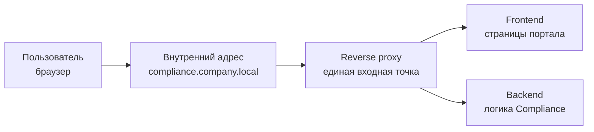
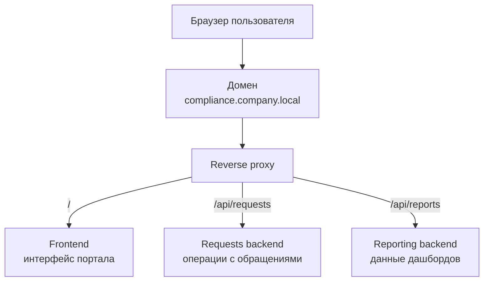
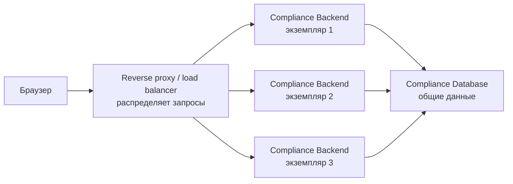

# Лекция 28. Reverse proxy и балансировка — обзор

## Где мы находимся в архитектуре

В прошлых уроках мы двигались от простого ядра `client -> frontend -> backend -> database` к стилям организации backend-части. Мы посмотрели на монолит и микросервисы и увидели, что внутреннее устройство системы может быть разным. Но пользователь обычно не знает, сколько приложений и сервисов живет внутри. Он открывает адрес Compliance-портала и ожидает, что запрос попадет туда, куда нужно.

Между пользователем и backend-частью часто стоит еще один компонент. Он принимает входящий запрос первым, а затем передает его дальше. Такой компонент называют reverse proxy. Если очень коротко, reverse proxy стоит "перед" приложениями и помогает управлять входящим трафиком.

Представим Compliance. Сотрудник открывает портал, офицер работает в рабочем месте, руководитель смотрит дашборд. Все они могут приходить на один внешний адрес, например `compliance.company.local`. Но внутри за этим адресом могут быть разные приложения или несколько копий одного backend. Reverse proxy помогает спрятать внутреннюю кухню за понятной точкой входа.

## Почему это называется reverse proxy

Слово proxy обычно означает посредника. Forward proxy работает от имени клиента: например, корпоративный прокси, через который сотрудники выходят в интернет. Reverse proxy работает с другой стороны: он стоит перед серверами и принимает запросы от клиентов, а потом решает, какому внутреннему серверу их передать.

Для пользователя reverse proxy обычно невидим. Он не думает: "Сейчас мой браузер обратится к proxy, а тот выберет backend". Он просто открывает систему. Но для архитектуры это важная граница. Именно здесь часто решаются задачи входа в систему, маршрутизации, TLS, ограничений трафика и распределения нагрузки.

На вводном уровне это проще увидеть на схеме:

Здесь `compliance.company.local` - учебный пример внутреннего корпоративного адреса. Это не папка, не пакет кода и не "локальная папка" на компьютере. Пользователь вводит такой адрес в браузере примерно так же, как вводит адрес сайта. Разница в том, что внутренний корпоративный адрес может быть доступен только из сети компании или через VPN.

Часть после домена называют путем. Например, в адресе `compliance.company.local/api/requests` домен - это `compliance.company.local`, а путь - `/api/requests`. Слово `api` в таком пути обычно подсказывает, что запрос идет не за HTML-страницей для человека, а к программному интерфейсу backend. Слово `requests` в нашем учебном примере означает область обращений. Это тоже не папка на диске: это договоренность о маршруте, по которому reverse proxy или backend понимает, куда направить запрос.

Когда внутри несколько компонентов, reverse proxy может использовать такие маршруты как правила сортировки входящих запросов:

Такую схему нельзя читать как список папок или пакетов. Слева показан адрес, на который приходит пользовательский или программный запрос. Подписи на стрелках - это пути в URL. Справа показаны компоненты, которые обрабатывают разные части системы. Аналитик не обязан настраивать Nginx или писать конфигурацию ingress, но ему полезно понимать, что единый адрес системы не всегда равен одному серверу внутри.

## Reverse proxy как входная дверь

Хорошая бытовая аналогия - ресепшен в офисном здании. Посетитель приходит не напрямую к каждому отделу. Сначала он попадает в общую точку входа, где его направляют дальше. Эта аналогия помогает понять роль посредника, но у нее есть граница: reverse proxy не "понимает бизнес" как человек на ресепшене. Он действует по техническим правилам маршрутизации, безопасности и доступности.

В Compliance reverse proxy может принять запрос к порталу сотрудника и отдать frontend. Может принять API-запрос на создание обращения и передать его backend. Может направить запросы к отчетам в отдельный reporting-компонент. При этом пользователь продолжает видеть один понятный адрес.

Для требований это важно. Если заказчик говорит "система должна быть доступна по единому адресу", за этим может стоять решение с reverse proxy. Если нужна отдельная зона для API, может появиться правило маршрутизации по пути `/api`. Если есть несколько окружений, например test и production, нужно понимать, какой адрес ведет куда.

## Балансировка нагрузки

Иногда одного экземпляра приложения мало или небезопасно. Если все запросы идут в один backend, его отказ остановит систему. Если нагрузка выросла, один экземпляр может не справляться. Тогда запускают несколько одинаковых экземпляров приложения, а перед ними ставят балансировщик.

Балансировка означает распределение входящих запросов между несколькими экземплярами. Экземпляр здесь - это запущенная копия одного и того же backend-приложения, а не отдельная функция или отдельный экран.

Для пользователя это все еще одна система. Для эксплуатации это уже более надежная схема: если один экземпляр выключили для обновления или он перестал отвечать, трафик можно отправлять на другие. При этом схема специально показывает общую базу данных: несколько копий backend не убирают все узкие места автоматически.

На уровне аналитика важно не уходить в алгоритмы балансировки. Не нужно сейчас разбирать round-robin, least connections или sticky sessions глубоко. Важно понять смысл: перед приложением может быть компонент, который распределяет запросы и помогает системе выдерживать нагрузку и отказ отдельных экземпляров.

## Что меняется в требованиях

Reverse proxy и балансировка редко появляются в пользовательском требовании напрямую. Пользователь не говорит: "Хочу reverse proxy". Он говорит: "Система должна быть доступна", "пользователь должен входить по корпоративному адресу", "во время обновления система не должна полностью останавливаться", "личные данные должны передаваться безопасно".

Эти требования могут привести к инфраструктурным решениям. Если Compliance должен быть доступен по HTTPS, где-то будет завершение TLS или проксирование защищенного соединения. Если нужно разделить frontend и API под одним доменом, понадобится маршрутизация. Если требуется выдержать нагрузку в дни отчетности, может понадобиться несколько экземпляров backend и балансировка.

Аналитик не обязан диктовать конкретный продукт. Но он должен уметь распознать, что требование имеет инфраструктурное последствие. Формулировка "система должна выдерживать 500 одновременных пользователей" звучит не как экранная функция, но она влияет на архитектуру.

## Health check и живые экземпляры

Когда перед приложением стоит балансировщик, ему нужно понимать, какие экземпляры живы. Обычно для этого используют health check: балансировщик периодически обращается к специальному endpoint или проверяет доступность приложения. Если экземпляр перестал отвечать, его временно исключают из распределения трафика.

В Compliance это может быть особенно важно для рабочего места офицера. Если один backend-экземпляр завис, офицер не должен постоянно попадать именно в него и видеть ошибки. Балансировщик может отправить следующий запрос на другой экземпляр.

Но health check не решает всех проблем. Экземпляр может формально отвечать "жив", но при этом база данных недоступна или часть функций работает плохо. Поэтому команда должна договариваться, что именно проверяет health endpoint. Для аналитика здесь полезен простой вопрос: как система поймет, что компонент не готов принимать запросы?

## Что reverse proxy не делает

Есть соблазн приписать reverse proxy слишком много смысла. Он может маршрутизировать, завершать TLS, ограничивать размер запросов, распределять трафик и помогать с базовой защитой. Но он не заменяет бизнес-логику и не должен быть единственным местом проверки прав.

Если сотрудник не должен видеть чужие обращения, это правило должно применяться в backend. Даже если reverse proxy умеет проверять токен или пропускать запросы только после SSO, он не знает всех бизнес-правил Compliance. Он может помочь на входе, но не становится владельцем доменной логики.

Так же балансировщик не делает приложение масштабируемым магически. Если база данных не выдерживает нагрузку или backend хранит состояние сессии только в памяти одного экземпляра, простое добавление нескольких копий может создать новые проблемы. Поэтому балансировка всегда связана с вопросами состояния, сессий, общей базы и наблюдаемости.

## Как это обсуждать на проекте

На встрече с разработчиками или архитектором аналитику не нужно говорить "поставим reverse proxy" как готовое решение. Лучше начать с требований и ограничений.

Например, система должна открываться по одному внутреннему домену. Frontend и API должны быть доступны под согласованными путями. Обновление backend не должно полностью останавливать портал. Ошибки одного экземпляра не должны ломать весь доступ. Запросы с вложениями должны иметь понятный лимит. Пользователь должен видеть корректное сообщение, если сервис временно недоступен.

Из таких требований архитектор уже выводит конкретную схему. Но аналитик понимает, почему в схеме появляется reverse proxy или балансировщик, и может связать этот компонент с пользовательскими ожиданиями.

## Практический итог урока

Reverse proxy - это входной компонент перед приложениями, который принимает запросы и направляет их дальше по техническим правилам. Балансировка распределяет запросы между несколькими экземплярами, чтобы система лучше справлялась с нагрузкой и отказами отдельных экземпляров.

Для Compliance это помогает представить единый корпоративный адрес, за которым могут скрываться frontend, backend, reporting-компонент и несколько экземпляров приложения. Пользователь видит одну систему, а внутри инфраструктура направляет запросы туда, где они должны быть обработаны.

Для аналитика главное - не настройка инструмента, а понимание связи между требованиями доступности, безопасности, маршрутизации и архитектурной схемой. В следующем уроке мы продолжим эту линию и посмотрим на API Gateway: компонент, который тоже стоит на границе, но решает немного другой класс задач.
