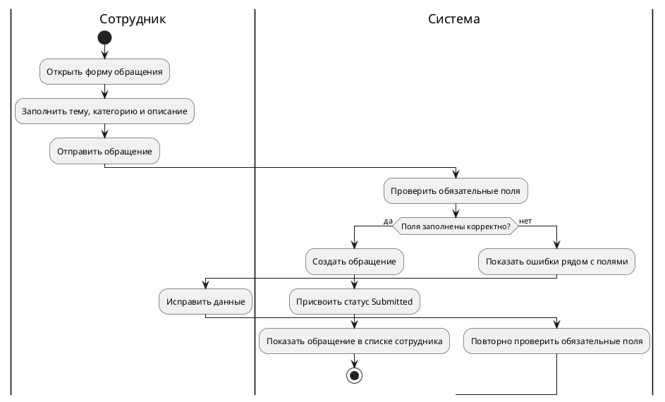
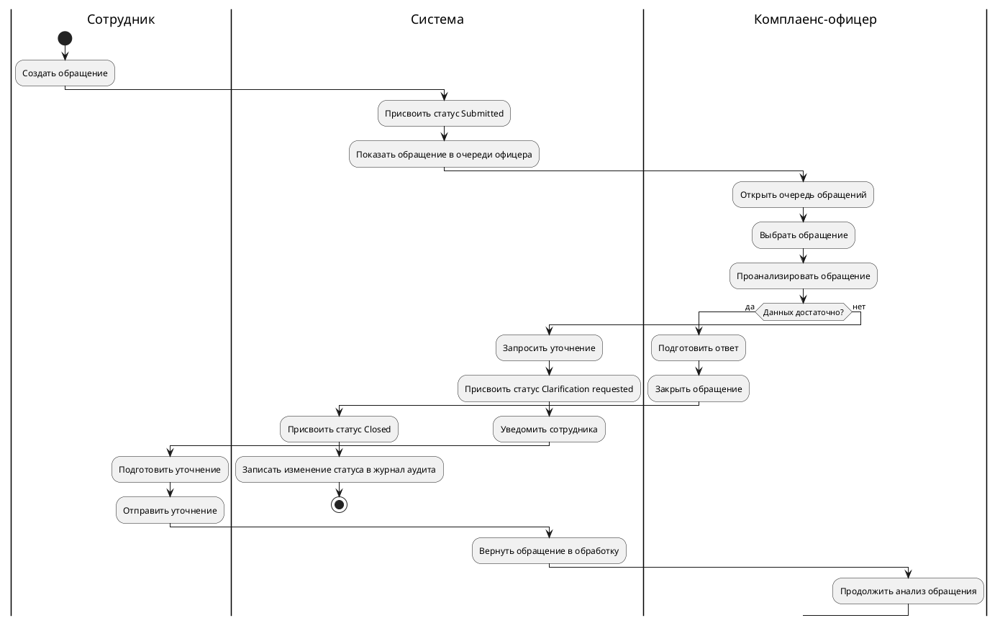

# Activity Diagrams: Compliance

Статус: черновик после урока 20.

## Назначение артефакта

Документ фиксирует TO-BE потоки действий для ключевых процессов Compliance-системы. Диаграммы активности уточняют use cases, показывают ответственность участников и помогают находить требования и открытые вопросы.

Связанные артефакты:

- `system-analysis/use-case-model.md`;
- `requirements/requirements-register.md`;
- `requirements/open-questions.md`;
- `specification/technical-assignment.md`.

## Диаграмма 1. Создание обращения сотрудником

### Требования и правила, найденные на диаграмме

| ID | Формулировка | Статус |
| --- | --- | --- |
| REQ-CMP-001 | Сотрудник должен иметь возможность создать обращение в отдел комплаенс через портал сотрудника. | candidate |
| REQ-CMP-009 | Система должна проверять обязательные поля обращения перед созданием обращения. | candidate |
| REQ-CMP-010 | Если обязательные поля не заполнены, система должна показать ошибки и не создавать обращение. | candidate |
| REQ-CMP-011 | После успешной отправки обращение должно получить статус `Submitted`. | candidate |

## Диаграмма 2. Обработка обращения с уточнением

### Требования и правила, найденные на диаграмме

| ID | Формулировка | Статус |
| --- | --- | --- |
| REQ-CMP-003 | Комплаенс-офицер должен видеть очередь обращений, назначенных на него. | candidate |
| REQ-CMP-004 | Комплаенс-офицер должен иметь возможность запросить уточнение по обращению у сотрудника. | candidate |
| REQ-CMP-008 | Действия с изменением статуса обращения должны попадать в журнал аудита. | candidate |
| REQ-CMP-012 | Система должна уведомлять сотрудника о запросе уточнения по обращению. | candidate |
| REQ-CMP-013 | После отправки уточнения обращение должно возвращаться в обработку комплаенс-офицера. | candidate |

## Открытые вопросы процесса

| ID | Вопрос | Влияние |
| --- | --- | --- |
| OQ-ACT-001 | Приостанавливается ли SLA на период ожидания уточнения от сотрудника? | Влияет на расчет просрочек и дашборд руководителя. |
| OQ-ACT-002 | Что происходит, если сотрудник не ответил на уточнение в срок? | Влияет на статусы, уведомления и эскалации. |
| OQ-ACT-003 | Можно ли переоткрыть закрытое обращение? | Влияет на жизненный цикл обращения и аудит. |
| OQ-ACT-004 | Какие статусы видит сотрудник, а какие только комплаенс-офицер? | Влияет на портал сотрудника и права доступа. |
| OQ-ACT-005 | Кто получает уведомление о просрочке обращения? | Влияет на дашборд и эскалации. |

## Следующие шаги

- Добавить найденные требования-кандидаты в `requirements/requirements-register.md`.
- Добавить вопросы OQ-ACT в `requirements/open-questions.md` или связать их с существующими вопросами.
- Уточнить жизненный цикл обращения на уроке про UML state diagram.
- Связать activity diagrams с разделом пользовательских сценариев в `specification/technical-assignment.md`.
