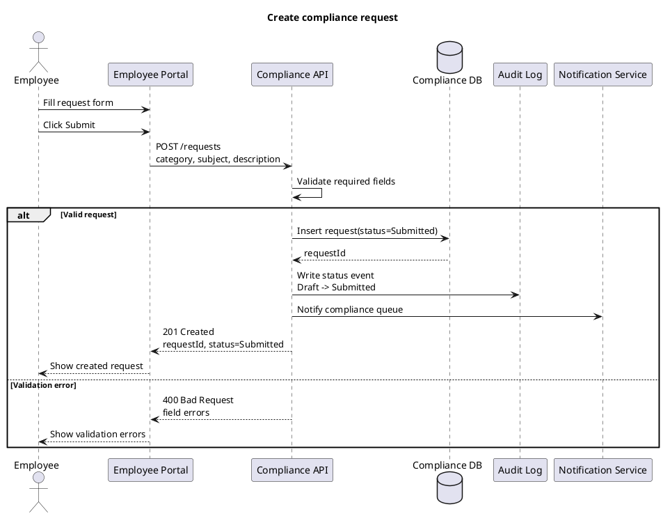
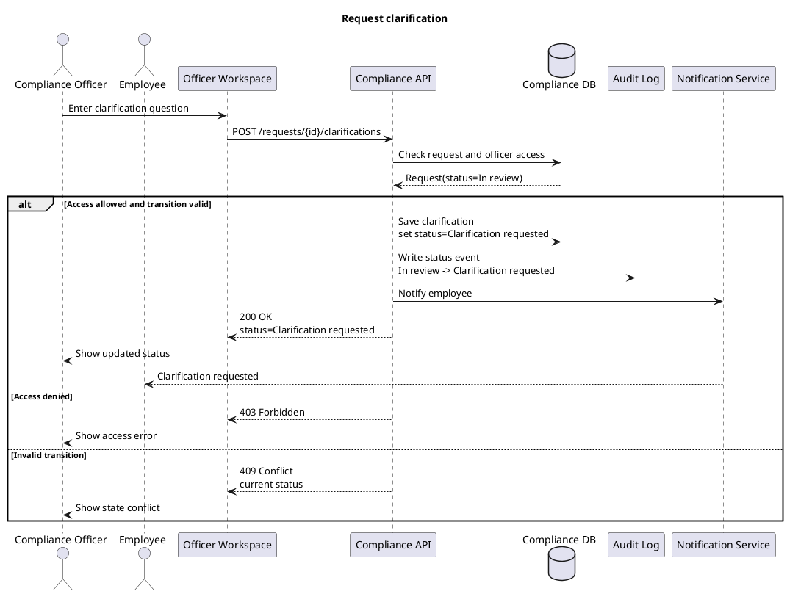
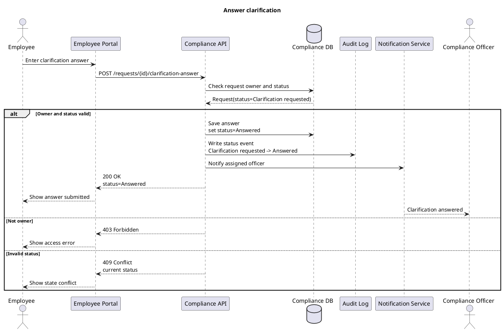

# Sequence Diagrams: Compliance

Статус: рабочий артефакт после урока 22.

## Назначение артефакта

Документ описывает взаимодействие участников и системных компонентов во времени для ключевых сценариев Compliance. Он связывает use cases, activity diagrams и state model с будущими требованиями к API, данным, уведомлениям и аудиту.

## Общие участники

| Участник | Тип | Назначение |
| --- | --- | --- |
| Employee | Actor | Сотрудник, создающий обращение и отвечающий на уточнения. |
| Compliance Officer | Actor | Офицер, который обрабатывает обращение. |
| Employee Portal | UI | Интерфейс сотрудника. |
| Officer Workspace | UI | Рабочее место комплаенс-офицера. |
| Compliance API | Backend | Принимает запросы, проверяет правила, меняет состояние обращения. |
| Compliance DB | Database | Хранит обращения, уточнения, статусы и служебные данные. |
| Audit Log | System component | Хранит события изменения статусов и значимые действия. |
| Notification Service | System component | Отправляет уведомления сотрудникам и офицерам. |

## Диаграмма 1. Создание обращения

### Найденные требования

| ID | Формулировка | Статус |
| --- | --- | --- |
| REQ-CMP-019 | API создания обращения должен возвращать идентификатор обращения и текущий статус после успешного создания. | candidate |
| REQ-CMP-020 | При ошибке валидации API должен возвращать список ошибок по полям, а интерфейс должен показать их сотруднику без создания обращения. | candidate |

## Диаграмма 2. Запрос уточнения

### Найденные требования

| ID | Формулировка | Статус |
| --- | --- | --- |
| REQ-CMP-021 | Система должна проверять право комплаенс-офицера перед изменением статуса обращения. | candidate |
| REQ-CMP-022 | Если переход статуса недопустим, API должен возвращать конфликт текущего состояния, а интерфейс должен показать понятное сообщение. | candidate |

## Диаграмма 3. Ответ на уточнение

### Найденные требования

| ID | Формулировка | Статус |
| --- | --- | --- |
| REQ-CMP-023 | Ответ на запрос уточнения может отправить только сотрудник, которому принадлежит обращение. | candidate |
| REQ-CMP-024 | После ответа сотрудника система должна уведомить назначенного комплаенс-офицера. | candidate |

## Открытые вопросы

| ID | Вопрос | Влияние |
| --- | --- | --- |
| OQ-SEQ-001 | Уведомления отправляются синхронно в рамках ответа API или через очередь сообщений? | Влияет на нефункциональные требования и будущую интеграционную схему. |
| OQ-SEQ-002 | Должен ли API возвращать человекочитаемый номер обращения отдельно от технического идентификатора? | Влияет на контракт создания обращения и UI. |
| OQ-SEQ-003 | Какие ошибки доступа и конфликта статуса должны видеть пользователи, а какие остаются техническими? | Влияет на UX, безопасность и спецификацию ошибок. |

## Связь с другими артефактами

- `system-analysis/state-model.md` задает допустимые переходы статусов.
- `system-analysis/activity-diagrams.md` задает процессный контекст.
- `requirements/requirements-register.md` должен быть дополнен требованиями REQ-CMP-019 - REQ-CMP-024.
- `requirements/open-questions.md` должен быть дополнен вопросами OQ-SEQ-001 - OQ-SEQ-003.
- `specification/technical-assignment.md` должен ссылаться на sequence diagrams как источник требований к взаимодействиям.
