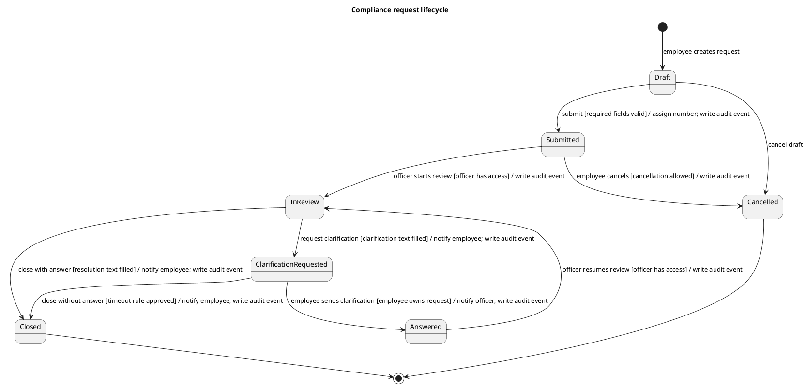

# State Model: Compliance Request

Статус: рабочий артефакт после урока 21.

## Назначение артефакта

Документ описывает жизненный цикл объекта `обращение в комплаенс`: допустимые состояния, события переходов, условия, системные действия и вопросы, которые нужно подтвердить у бизнеса.

Модель дополняет:

- `system-analysis/use-case-model.md` - кто взаимодействует с системой;
- `system-analysis/activity-diagrams.md` - как идет процесс обработки;
- `requirements/requirements-register.md` - какие требования уже зафиксированы;
- `requirements/open-questions.md` - какие решения еще не приняты.

## Объект моделирования

Объект: `Compliance request`.

Граница: жизненный цикл обращения от создания черновика сотрудником до закрытия или отмены. Декларации, подарки и аудит как отдельные объекты пока не моделируются.

## Состояния

| State | Описание | Видимость для сотрудника | Основные разрешенные действия |
| --- | --- | --- | --- |
| Draft | Сотрудник создал черновик, но еще не отправил обращение. | Да | Редактировать, отправить, отменить |
| Submitted | Обращение отправлено и ожидает обработки. | Да | Просмотреть, отменить при разрешенном правиле |
| In review | Комплаенс-офицер взял обращение в работу. | Да, как "В обработке" | Запросить уточнение, закрыть |
| Clarification requested | От сотрудника запрошена дополнительная информация. | Да | Ответить на уточнение |
| Answered | Сотрудник отправил уточнение, обращение ожидает продолжения проверки. | Да | Просмотреть |
| Closed | Обращение закрыто с ответом или решением. | Да | Просмотреть |
| Cancelled | Обращение отменено сотрудником или системой по правилу. | Да | Просмотреть |

## Диаграмма состояний

## Таблица переходов

| From | Event | Guard | To | System actions | Trace |
| --- | --- | --- | --- | --- | --- |
| Draft | Employee submits request | Required fields are valid | Submitted | Assign request number, save request, write audit event | REQ-CMP-009, REQ-CMP-011 |
| Draft | Employee cancels draft | Request is not submitted | Cancelled | Mark draft as cancelled | New rule |
| Submitted | Officer starts review | Officer has access to request | In review | Assign officer if needed, write audit event | REQ-CMP-003, REQ-CMP-008 |
| Submitted | Employee cancels request | Cancellation after submit is allowed | Cancelled | Mark as cancelled, write audit event | Open question |
| In review | Officer requests clarification | Clarification text is filled | Clarification requested | Notify employee, write audit event | REQ-CMP-004, REQ-CMP-012 |
| Clarification requested | Employee sends clarification | Employee owns request | Answered | Save answer, notify officer, write audit event | REQ-CMP-013 |
| Answered | Officer resumes review | Officer has access to request | In review | Write audit event | REQ-CMP-013 |
| In review | Officer closes request | Resolution text is filled | Closed | Save resolution, notify employee, write audit event | REQ-CMP-008 |
| Clarification requested | Officer closes without answer | Timeout rule is approved | Closed | Save closure reason, notify employee, write audit event | Open question |

## Требования и бизнес-правила, найденные на модели

| ID | Формулировка | Тип | Статус |
| --- | --- | --- | --- |
| REQ-CMP-014 | Система должна хранить статус обращения как одно из допустимых значений жизненного цикла: `Draft`, `Submitted`, `In review`, `Clarification requested`, `Answered`, `Closed`, `Cancelled`. | Business rule | candidate |
| REQ-CMP-015 | Система должна запрещать переход обращения в статус, который не предусмотрен моделью состояний. | Business rule | candidate |
| REQ-CMP-016 | После перехода обращения в `Submitted` сотрудник не должен редактировать исходный текст обращения, кроме ответа на запрос уточнения. | Functional / access rule | candidate |
| REQ-CMP-017 | При закрытии обращения комплаенс-офицер должен заполнить текст ответа или решения. | Functional | candidate |
| REQ-CMP-018 | Система должна сохранять дату, время, инициатора и исходный/целевой статус для каждого значимого перехода обращения. | Nonfunctional / audit | candidate |

## Открытые вопросы

| ID | Вопрос | Влияние |
| --- | --- | --- |
| OQ-STATE-001 | Можно ли сотруднику отменить обращение после отправки? | Влияет на переход `Submitted -> Cancelled`. |
| OQ-STATE-002 | Закрывается ли обращение автоматически или вручную, если сотрудник не ответил на уточнение в срок? | Влияет на переход `Clarification requested -> Closed`. |
| OQ-STATE-003 | Нужно ли отдельное состояние `Overdue`, или просрочка является вычисляемым признаком поверх текущего статуса? | Влияет на SLA и дашборд руководителя. |
| OQ-STATE-004 | Можно ли переоткрыть закрытое обращение? | Влияет на финальность состояния `Closed`. |

## Связь с другими артефактами

- `requirements/requirements-register.md` должен быть дополнен требованиями REQ-CMP-014 - REQ-CMP-018.
- `requirements/open-questions.md` должен быть дополнен вопросами OQ-STATE-001 - OQ-STATE-004.
- В `specification/technical-assignment.md` модель состояний должна быть указана как источник правил жизненного цикла обращения.
