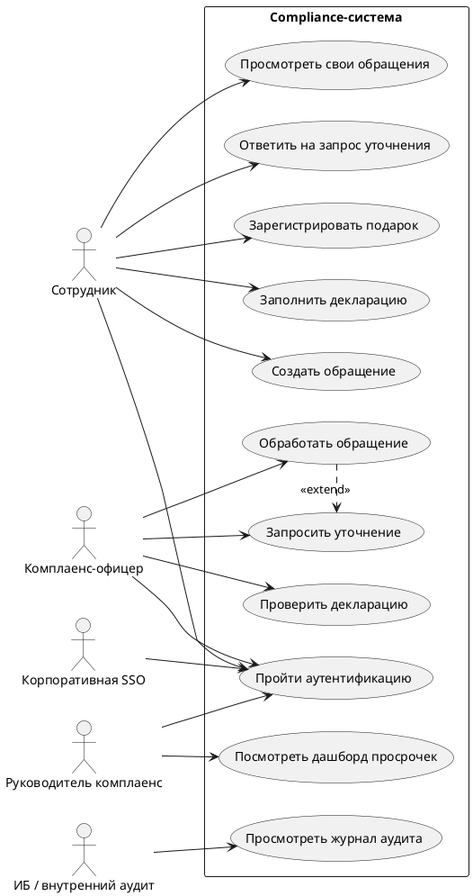

# Use Case Model: Compliance

Статус: черновик после урока 19.

## Назначение артефакта

Модель сценариев использования фиксирует внешние роли, границу Compliance-системы и пользовательские цели, которые система должна поддержать. Артефакт используется как мост между реестром требований, будущими activity diagrams и разделами ТЗ.

## Граница системы

В границу Compliance-системы входят:

- портал сотрудника для обращений, подарков и деклараций;
- рабочее место комплаенс-офицера;
- дашборды руководителя комплаенс;
- журналирование значимых действий;
- использование корпоративной SSO для аутентификации.

Вне границы системы:

- корпоративная SSO как внешняя система;
- сотрудники и подразделения компании;
- внутренний аудит / ИБ как внешние проверяющие роли;
- внешние регуляторы, если они не работают в системе напрямую.

## Акторы

| Актор | Тип | Интерес / цель | Комментарий |
| --- | --- | --- | --- |
| Сотрудник компании | человек / роль | Подать обращение, зарегистрировать подарок, заполнить декларацию, видеть свои записи. | Один человек может также быть руководителем, но в этой модели он действует как сотрудник. |
| Комплаенс-офицер | человек / роль | Обработать обращения, запросить уточнение, проверить декларации и подарки. | Основной рабочий пользователь служебной части. |
| Руководитель комплаенс | человек / роль | Смотреть просрочки, нагрузку и управленческую отчетность. | Работает с агрегированной информацией. |
| Корпоративная SSO | внешняя система | Подтвердить личность пользователя. | Не разрабатывается в рамках Compliance-системы. |
| ИБ / внутренний аудит | роль контроля | Проверить доступы, журнал действий и доказуемость процесса. | Прямой доступ к системе требует уточнения. |

## Use cases

| ID | Use case | Основной актор | Краткая цель | Связанные требования |
| --- | --- | --- | --- | --- |
| UC-CMP-001 | Пройти аутентификацию | Сотрудник / офицер / руководитель | Получить доступ к системе через SSO. | REQ-CMP-007 |
| UC-CMP-002 | Создать обращение | Сотрудник | Передать вопрос или запрос в комплаенс. | REQ-CMP-001 |
| UC-CMP-003 | Просмотреть свои обращения | Сотрудник | Видеть историю и статусы собственных обращений. | REQ-CMP-002 |
| UC-CMP-004 | Ответить на запрос уточнения | Сотрудник | Передать дополнительную информацию офицеру. | REQ-CMP-004 |
| UC-CMP-005 | Зарегистрировать подарок | Сотрудник | Зафиксировать сведения о подарке для проверки. | Требование требует детализации |
| UC-CMP-006 | Заполнить декларацию | Сотрудник | Отправить декларацию за период. | Требование требует детализации |
| UC-CMP-007 | Обработать обращение | Комплаенс-офицер | Проверить обращение и подготовить решение или ответ. | REQ-CMP-003, REQ-CMP-004, REQ-CMP-008 |
| UC-CMP-008 | Запросить уточнение по обращению | Комплаенс-офицер | Получить недостающие данные от сотрудника. | REQ-CMP-004 |
| UC-CMP-009 | Проверить декларацию | Комплаенс-офицер | Рассмотреть отправленную декларацию. | Требование требует детализации |
| UC-CMP-010 | Посмотреть дашборд просрочек | Руководитель комплаенс | Контролировать просроченные обращения по подразделениям. | REQ-CMP-005, REQ-CMP-006 |
| UC-CMP-011 | Просмотреть журнал аудита | ИБ / внутренний аудит | Проверить значимые действия и изменения статусов. | REQ-CMP-008 |

## Диаграмма

## Текстовые сценарии

### UC-CMP-002. Создать обращение

Основной поток:

1. Сотрудник проходит аутентификацию через SSO.
2. Сотрудник открывает создание обращения.
3. Сотрудник указывает тему, категорию и описание.
4. Система проверяет обязательные поля.
5. Сотрудник отправляет обращение.
6. Система создает обращение со статусом `Submitted`.
7. Система показывает обращение в списке обращений сотрудника.

Альтернативы:

- если обязательное поле не заполнено, система показывает ошибку и не создает обращение;
- если SSO недоступна, сотрудник не получает доступ к системе.

### UC-CMP-007. Обработать обращение

Основной поток:

1. Комплаенс-офицер проходит аутентификацию через SSO.
2. Офицер открывает очередь назначенных обращений.
3. Офицер выбирает обращение.
4. Офицер анализирует описание, категорию и вложения.
5. Офицер готовит ответ или решение.
6. Офицер закрывает обращение.
7. Система фиксирует изменение статуса в журнале аудита.

Расширение:

- UC-CMP-008 `Запросить уточнение` выполняется, если данных недостаточно.

### UC-CMP-010. Посмотреть дашборд просрочек

Основной поток:

1. Руководитель комплаенс проходит аутентификацию через SSO.
2. Руководитель открывает дашборд.
3. Руководитель выбирает период.
4. Система показывает количество просроченных обращений по подразделениям.
5. Система показывает время последнего обновления данных.

## Открытые вопросы

| ID | Вопрос | Влияние |
| --- | --- | --- |
| OQ-UC-001 | Имеет ли ИБ / внутренний аудит прямой доступ к журналу аудита в системе? | Влияет на актора и use case `Просмотреть журнал аудита`. |
| OQ-UC-002 | Входит ли выгрузка отчетов в MVP? | Может добавить use case для руководителя или аудита. |
| OQ-UC-003 | Регистрация подарка является самостоятельным процессом или типом обращения? | Влияет на границы use cases и будущую activity diagram. |

## Связь с другими артефактами

- `requirements/requirements-register.md` - требования, связанные с use cases.
- `requirements/open-questions.md` - вопросы, которые требуют решения.
- `specification/technical-assignment.md` - будущий раздел пользовательских сценариев.
- `system-analysis/activity-diagrams.md` - следующий артефакт, который уточнит порядок шагов для ключевых use cases.
